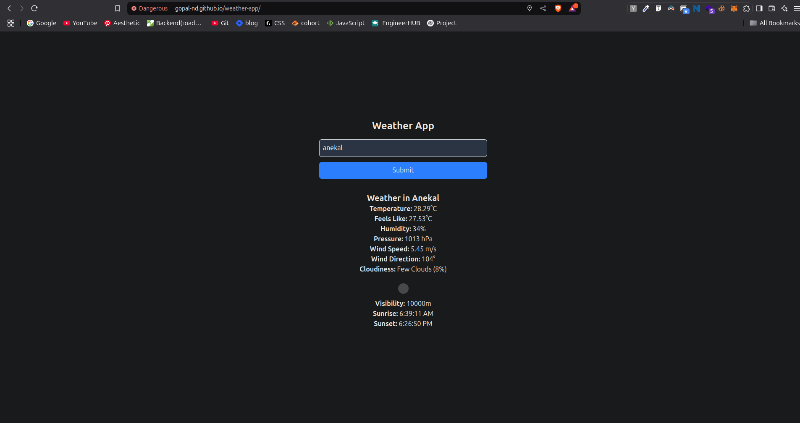
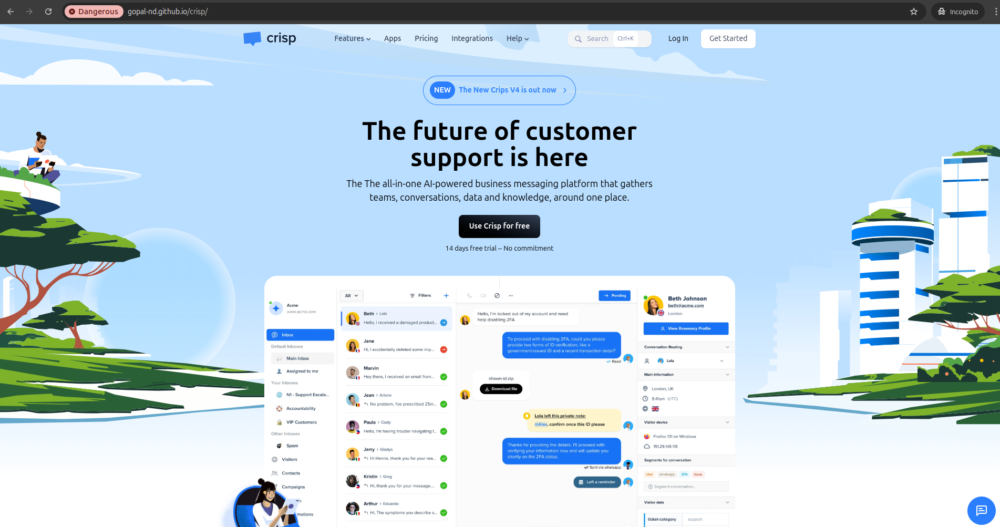
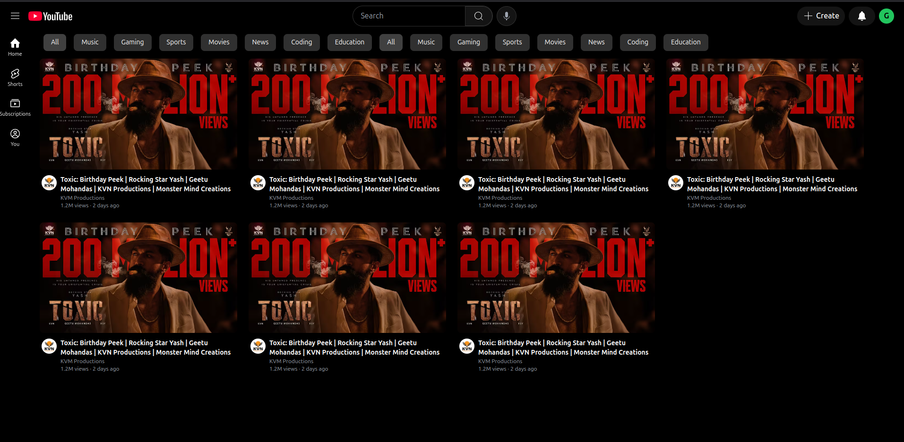

# Cohort Output ( Projects )

> ## JavaScript 

### TypeRacer

[live Demo](https://gopal-nd.github.io/typewrite/)

[source code](https://github.com/Gopal-nd/typewrite)

---

### Memory Grid

[live Demo](https://gopal-nd.github.io/memory-grid/)

[source code](https://github.com/Gopal-nd/memory-grid)

---

### Calculator

[live Demo](https://gopal-nd.github.io/calculator/)

[source code](https://github.com/Gopal-nd/calculator)

---

### ToDo App

[live Demo](https://gopal-nd.github.io/to-do-app/)

[source code](https://github.com/Gopal-nd/to-do-app)

---

### Weather APP

[live Demo](https://gopal-nd.github.io/weather-app/)

[source code](https://github.com/Gopal-nd/weather-app)

---

> ## HTML and CSS

### Crisp Clone

[live Demo](https://gopal-nd.github.io/crisp/)

[source code](https://github.com/Gopal-nd/crisp)

---

### Netflix Clone

[live Demo](https://gopal-nd.github.io/netflix-clone/) 

[source code](https://github.com/Gopal-nd/netflix-clone)

---

### Youtube Clone

[source code](https://github.com/Gopal-nd/cohort/blob/master/CSS/Projects/youtube/index.html)
